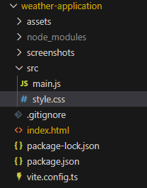

#  Weather Application

A simple and responsive **Weather Forecast Web Application** that allows
users to search for any city and view real-time weather information such
as temperature, humidity, wind speed, and weather conditions.

This project demonstrates **API integration, asynchronous JavaScript,
and responsive UI design**.

------------------------------------------------------------------------

##  Features

-    Search weather by city name
-    Search weather by current location
-    Display real-time temperature
-    Show humidity levels
-    Display wind speed
-    Weather condition icons
-    Responsive design for different devices
-    Fast API-based weather data fetching

------------------------------------------------------------------------

##  Tech Stack

-   **HTML5** -- Structure of the application\
-   **CSS3** -- Styling and responsive layout\
-   **JavaScript (ES6)** -- Application logic and API calls\
-   **Weather API:** OpenWeatherMap
-   **Geolocation API:** Browser's geolocation API
------------------------------------------------------------------------

##  Project Structure

   
------------------------------------------------------------------------

##  How It Works

1.  User enters a **city name** in the search box.
2.  JavaScript sends a **request to the geo location weather API** to display location suggestions.
3.  On selecting a location from the list.
4.  JavaScript sends a **request to the weather API**.
5.  The API returns **weather data in JSON format**.
6.  The application extracts and displays:
    -   Temperature
    -   Weather condition
    -   Humidity
    -   Wind speed
7.  On clicking dropdown icon in search bar **recently searched locations are displayed**.
8.  On clicking **Current Location button fetches current location data**

------------------------------------------------------------------------

##  API Setup

This application uses the **OpenWeatherMap API**.

### Steps to Get API Key

1.  Go to https://openweathermap.org
2.  Create a free account
3.  Generate an **API Key**

Replace the API key in your JavaScript file:

``` javascript
const apiKey = "YOUR_API_KEY";
```

------------------------------------------------------------------------

## Run Locally

Clone the repository:

``` bash
git clone https://github.com/chanduzumba/weather-application.git
```

Navigate to the project folder:

``` bash
cd weather-application
```

Open the project:

``` bash
npm install
npm run dev
```

------------------------------------------------------------------------

## Screenshots


------------------------------------------------------------------------

## Author

**Chandrika Prakash**

-   GitHub: https://github.com/chanduzumba
-   LinkedIn: http://www.linkedin.com/in/chandrika-prakash-06723a266

------------------------------------------------------------------------

⭐ If you like this project, consider **starring the repository**!
